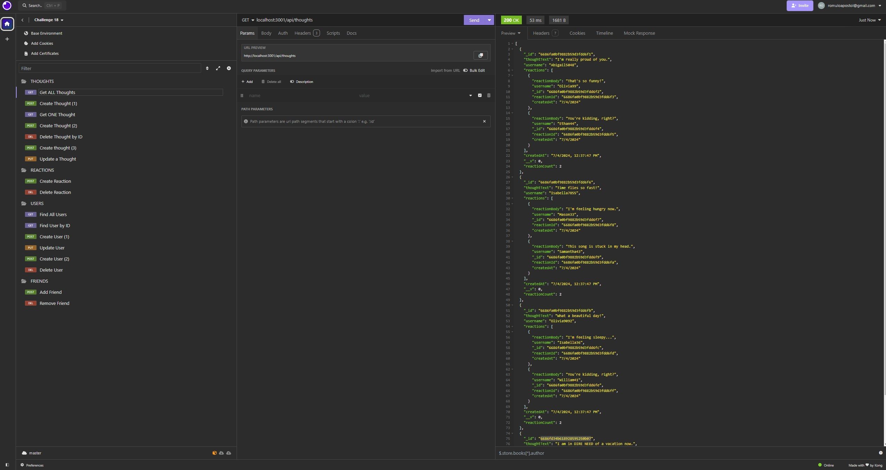

# CHALLENGE 18 NOSQL SOCIAL NETWORK API

## DESCRIPTION
Are you creating a social media network and need a NOSQL database so that your website can handle large amounts of unstructured data?
Then look no further! This is the application for you! With this application, you can easily get all users, add new users, create your own thoughts, update them and delete them.

## HOW TO USE
To use this application, you first need to start by entering the following command in your terminal, 'npm run seed' and then 'npm run start'. Then you can open Insomnia and enter your 'GET', 'POST', 'PUT', and 'DELETE' commands.

## ACCEPTANCE CRITERIA
GIVEN a social network API\
WHEN I enter the command to invoke the application\
THEN my server is started and the Mongoose models are synced to the MongoDB database\
WHEN I open API GET routes in Insomnia for users and thoughts\
THEN the data for each of these routes is displayed in a formatted JSON\
WHEN I test API POST, PUT, and DELETE routes in Insomnia\
THEN I am able to successfully create, update, and delete users and thoughts in my database\
WHEN I test API POST and DELETE routes in Insomnia\
THEN I am able to successfully create and delete reactions to thoughts and add and remove friends to a user’s friend list

## VIEWING MY PROJECT
Link to GitHub: <i> https://github.com/rapostoljr/challenge_18_nosql_social_network_api.git </i>\
Video link: <i> https://drive.google.com/file/d/1R-Z9uvtEVsTTRA8s5Dosc83-Ls1OyUo7/view </i>